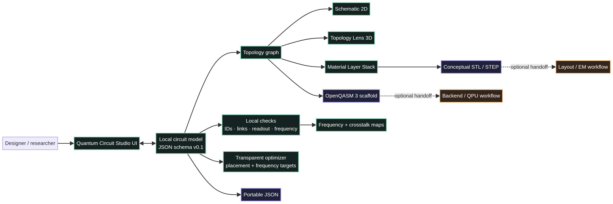
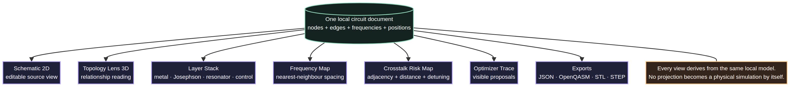
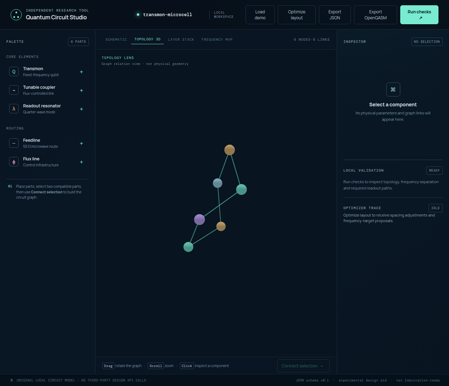
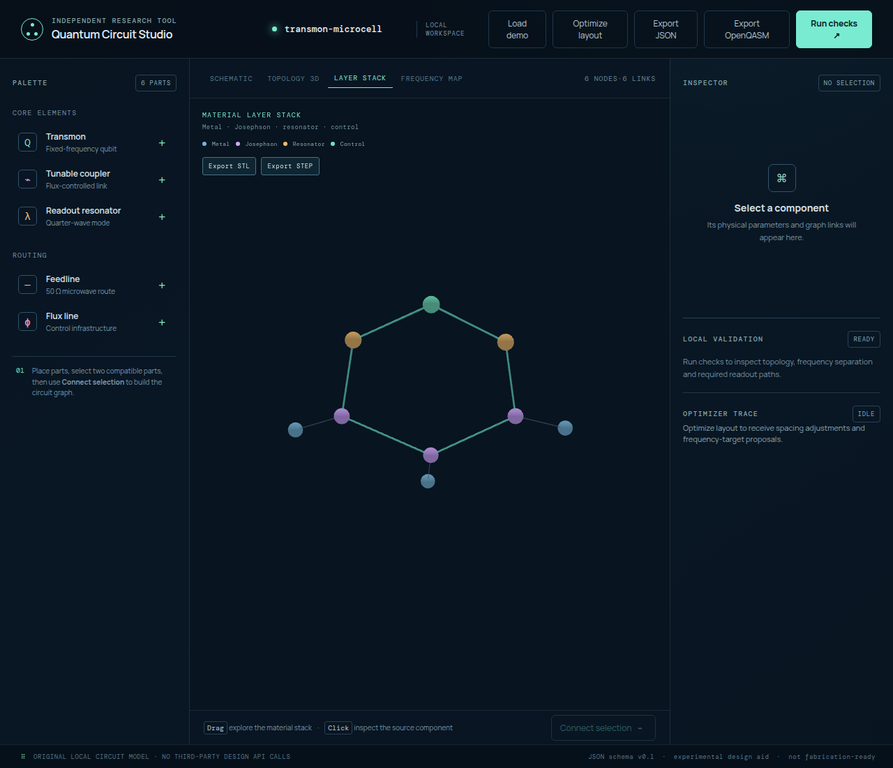

# Architecture and local model

Quantum Circuit Studio is organised around one rule: **the local circuit document is the source of truth**. The editor, 3D views, maps, optimizer and exports all derive from that same compact JSON model. This prevents a visual projection from silently becoming a second and inconsistent circuit definition.



## The local document

The core model is declared in [`src/model.mjs`](../src/model.mjs). A project contains a schema name, a project name, an array of nodes and an array of graph edges. Nodes carry the values that the current studio can inspect directly.

```json
{
  "schema": "quantum-circuit-studio/v0.1",
  "name": "transmon-microcell",
  "nodes": [
    { "id": "q0", "kind": "qubit", "frequency": 4.96, "unit": "GHz", "x": 28, "y": 48 }
  ],
  "edges": [["q0", "c0"]]
}
```

| Field | Meaning in the current studio | Important boundary |
|---|---|---|
| `id` | Stable local identity used by views, links and exports | It is not a foundry or backend hardware identifier. |
| `kind` | `qubit`, `coupler`, `resonator`, `feedline` or `flux` | It expresses a modelling role, not a complete device definition. |
| `frequency` | Nominal local working value | It is not an extracted or calibrated device frequency. |
| `x`, `y` | Editable schematic coordinates | They are not lithographic dimensions. |
| `edges` | Explicit circuit-topology relations | They do not contain capacitance, inductance or coupling strength. |

## Component vocabulary

| Local kind | UI label | Purpose in the model |
|---|---|---|
| `qubit` | Transmon | Fixed-frequency superconducting-qubit placeholder. |
| `coupler` | Tunable coupler | Flux-controlled relationship element between qubits. |
| `resonator` | Readout resonator | Readout-path component associated with a qubit. |
| `feedline` | Feedline | Shared microwave-route placeholder. |
| `flux` | Flux line | Low-frequency control-infrastructure placeholder. |

## One source, many projections



The four canvas views have different jobs. The **Schematic** is the editable spatial view. **Topology 3D** exposes the graph as a navigable relation view. **Layer Stack** creates a conceptual separation of metal, Josephson, resonator and control families. **Frequency Map** reads nominal qubit frequencies and local risk signals. None of these projections adds unseen physical data to the source document.

### Topology Lens

Topology Lens loads the `3d-force-graph` dependency only when its view is opened. It renders the same component IDs and valid graph links as the local document. A node click routes back to the same inspector used by the 2D schematic. The lens is consequently an exploration tool rather than a second editor or a claim about physical geometry.



### Layer Stack

Layer Stack places qubits and couplers in conceptual metal and Josephson proxies, readout resonators in the resonator layer, and feedlines or flux lines in the control layer. The vertical separation makes families of components readable during a design discussion. The `z` levels are visual offsets, not process thicknesses, dielectric definitions or a PDK.



## Code map

| File | Responsibility |
|---|---|
| [`src/model.mjs`](../src/model.mjs) | Model creation, graph helpers, checks, projections, risk functions, optimizer and OpenQASM generation. |
| [`src/app.js`](../src/app.js) | Browser state, event handling, inspector, canvas rendering, downloads and optional 3D loading. |
| [`src/mechanical-export.mjs`](../src/mechanical-export.mjs) | Conceptual ASCII STL and STEP exports. |
| [`tests/model.test.mjs`](../tests/model.test.mjs) | Model-level regression contracts. |
| [`src/styles.css`](../src/styles.css) and [`src/crosstalk.css`](../src/crosstalk.css) | Visual system for the workspace, maps and risk panels. |

The repository keeps the local model separate from visual concerns. This is why tests can validate circuit rules and exports without needing a browser or WebGL context.

Continue with [Validation and boundaries](VALIDATION.md) for the meaning of warnings and scores, then [Exports](EXPORTS.md) for the handoff formats.
