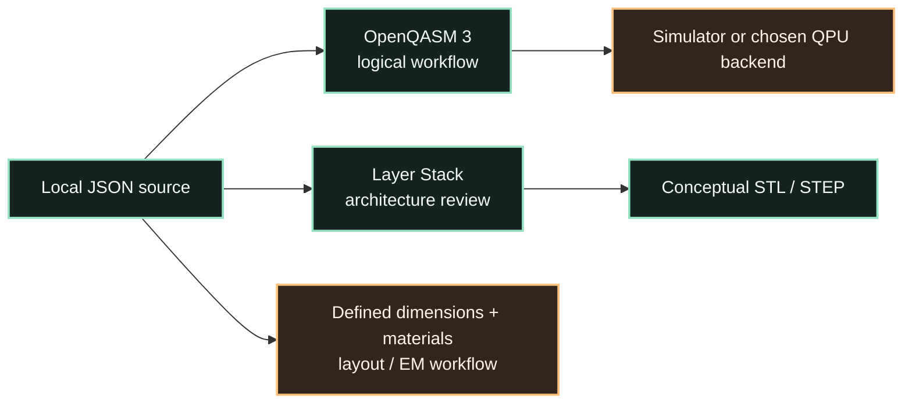

# Exports and handoff boundaries

Quantum Circuit Studio exports several artefacts because different questions need different representations. The formats are intentionally explicit about their boundary: a graph export is not a mask, a logical circuit scaffold is not a calibrated control schedule, and a conceptual solid is not a manufacturing package.

## Export matrix

| Format | Contains | Best use | Does not contain |
|---|---|---|
| **JSON** | Local nodes, links, nominal frequencies, positions, notes and schema version. | Project persistence, review and custom local tooling. | Physical geometry, materials or calibration. |
| **OpenQASM 3** | Logical qubit register, inferred `cz` topology and measurement scaffold. | Logical-circuit handoff and early backend workflow preparation. | Pulses, device calibration, EM parameters or fabrication data. |
| **STL** | ASCII conceptual solids for Layer Stack proxies. | A visual or mechanical-review conversation about the conceptual stack. | Tolerances, masks, PDK rules, package geometry or tapeout data. |
| **STEP** | ASCII STEP conceptual layer proxies. | Interchange into a CAD-oriented review context with clear caveats. | A fully defined mechanical or physical design. |

## JSON: preserve the source of truth

Use JSON whenever the current graph is meaningful and needs to be shared, versioned or restored. The JSON export is the only output that retains the complete editable local document. It is therefore the appropriate starting point for a future importer, a design-review archive or a dedicated adapter.

## OpenQASM 3: logical topology adapter

The OpenQASM export maps each local transmon to an element of a logical qubit register. When two local transmons share a tunable coupler, the exporter emits one inferred `cz` relation. A measurement scaffold is appended so the output is visibly a circuit-shaped starting point rather than an incomplete fragment.

```qasm
OPENQASM 3.0;
include "stdgates.inc";

qubit[2] q;
bit[2] c;
// coupler c0
cz q[0], q[1];
c[0] = measure q[0];
c[1] = measure q[1];
```

The exporter preserves the local component IDs and nominal frequency values as comments for traceability. OpenQASM describes a circuit program, while execution semantics and capability support remain an implementation concern [1]. Before using a target backend, choose that backend explicitly and transpile the logical circuit against its current constraints.

## Conceptual STL and STEP

Layer Stack can export STL and STEP files. The exporter places an explicit non-fabrication marker in the contents of each file. This is intentional. The generated solids help carry the *explanatory architecture* into a mechanical or visual review; they do not carry process dimensions, materials, junction details, ports, tolerances, or a manufacturing-ready stack.

> Do not send these conceptual STL or STEP files directly to a fabrication, packaging or EM-validation workflow. First replace proxies with a defined process, units, geometry, materials and design rules.

## Suggested handoff sequence

Start from JSON and preserve the original local graph. When the question is logical topology, produce OpenQASM and choose a backend or simulator separately. When the question is physical circuit behaviour, define a real layout and run an engineering workflow with material and process data. When the question is simply architectural communication, use the Layer Stack and its conceptual mechanical exports.



## References

[1]: [OpenQASM Live Specification — Introduction](https://openqasm.com/intro.html)
