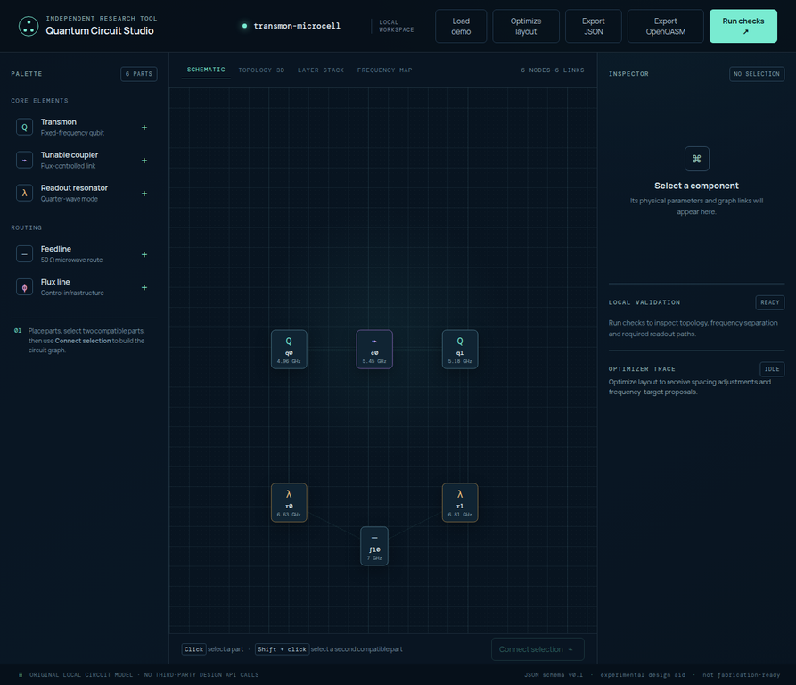

# Getting started

Quantum Circuit Studio is designed for short, explicit exploration cycles. You start with a local circuit graph, make each design assumption visible, run checks, inspect the consequences, and export a traceable artefact only when the local model is coherent. The application works entirely in the browser after its local front-end has been started; it does not need an external design API for its core model.

## Installation

The repository uses Node.js, pnpm and Vite. Install dependencies once, start the local workstation, then open the URL printed by Vite.

```bash
pnpm install
pnpm dev
```

The model-level regression suite is deliberately separate from the browser. Run it before publishing a model or export change.

```bash
pnpm test
pnpm build
```

## First five minutes

The fastest way to understand the studio is to load the included `transmon-microcell` demonstration. It contains two transmons, a tunable coupler, two readout resonators and a shared feedline. Select any component to inspect its identifier, frequency, 2D position, notes and graph links. The inspector edits the local source model; the 3D and analytical views derive from that same model.



| Step | Action | What to look for |
|---|---|---|
| 1 | Select **Load demo** | A complete two-transmon local graph appears. |
| 2 | Press **Run checks** | The local validator reports graph, frequency and readout-path findings. |
| 3 | Open **Topology 3D** | The same nodes and links appear as a navigable relation graph. |
| 4 | Open **Layer Stack** | The graph is projected into metal, Josephson, resonator and control proxies. |
| 5 | Open **Frequency Map** | Nearest-neighbour separations and crosstalk-priority pairs are shown. |
| 6 | Press **Optimize layout** | Inspect the exact position and frequency-target proposals before using them. |

## Build a graph from scratch

Add a component from the left palette. The studio assigns a stable ID such as `q0`, `c0` or `r0`. Click one component, then use **Shift + click** to select a compatible second component. The **Connect selection** button adds one graph link. Repeating the same connection in reverse does not duplicate it.

The schematic is intentionally not a mask editor. Coordinates are a compact spatial representation used by the diagram, the local spacing proposal and the crosstalk proxy. If you need fabrication geometry, move from the exported model to a specialised layout and engineering workflow after supplying process-specific dimensions.

## Choose the correct view

| View | Question it answers well | Question it does not answer |
|---|---|---|
| **Schematic** | What is the editable local graph and where are its components placed? | What are the physical dimensions or electromagnetic modes? |
| **Topology 3D** | Which elements are related in the graph? | Is this the true three-dimensional chip geometry? |
| **Layer Stack** | Which conceptual family of material layer does each component belong to? | Is this a process stack or mask set? |
| **Frequency Map** | Which qubits are spectrally close in the local model? | What frequencies will a fabricated device measure? |

The following captures show the real optional exploration views using the same bundled local demonstration. They document the current browser interface; they are not fabrication or EM evidence.

| Topology Lens | Layer Stack |
|---|---|
|  |  |

## Work with the local model deliberately

The local document uses the schema identifier `quantum-circuit-studio/v0.1`. Every node carries its ID, component kind, nominal frequency, unit, local coordinates and notes. The document’s edges are pairs of node IDs. Save a JSON export whenever a design state becomes meaningful. This makes the exact graph, assumptions and frequencies recoverable even if the browser session later changes.

> The demo values are working assumptions for a small research sketch. They are not extracted physical parameters.

Continue with [Architecture](ARCHITECTURE.md) to understand the model and projections, [Validation](VALIDATION.md) to interpret checks and risk maps, and [Exports](EXPORTS.md) to choose the correct artefact for a next workflow.
