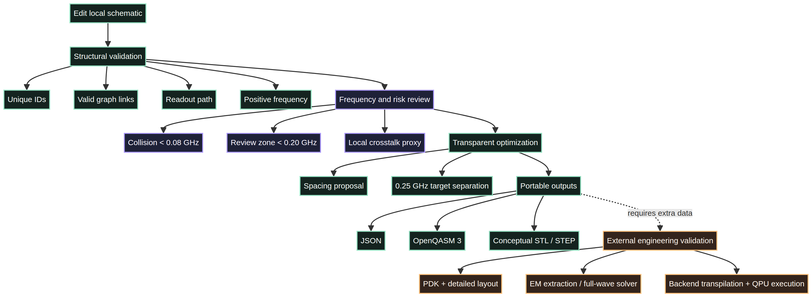
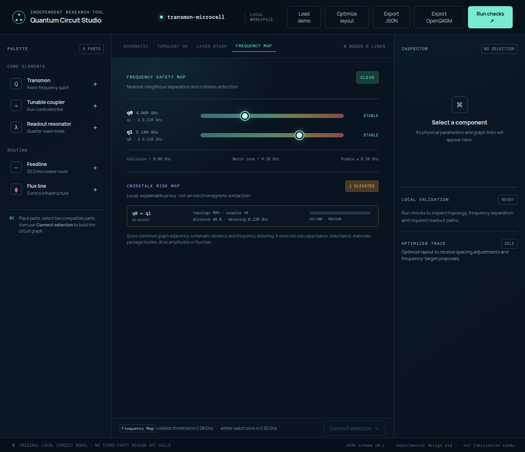

# Validation, frequency review and model boundaries

Quantum Circuit Studio uses validation as a sequence of increasingly specific local checks. The checks make structural problems and assumptions visible early. They are not a substitute for process design, electromagnetic extraction, calibration or hardware measurements.

## What “Run checks” validates

The local validator checks the JSON model for unique component identifiers, valid graph references, positive frequencies for applicable components, qubit readout paths and close nominal qubit frequencies. A valid report means that the local graph obeys these contracts. It does not mean that a physical chip has been validated.

| Check | Local rule | Why it matters | Does not establish |
|---|---|---|---|
| Identifier uniqueness | A node ID appears only once. | Links and exports remain unambiguous. | Hardware identity. |
| Graph integrity | Every edge points to existing nodes. | The topology can be traversed reliably. | Physical routing. |
| Frequency validity | Applicable components have positive numeric values. | Analytical views receive coherent input. | Measured resonance. |
| Readout path | A qubit has a linked readout resonator. | Readout intent is represented in the graph. | Readout fidelity or SNR. |
| Collision warning | Two nominal qubits are closer than `0.08 GHz`. | A close pair becomes visible immediately. | A measured spectral collision. |

## Frequency Map

Frequency Map compares each qubit to its closest nominal spectral neighbour. It uses a red collision state below `0.08 GHz`, a review state below `0.20 GHz`, and a stable state at or above `0.20 GHz`. These values are fixed, explicit **working thresholds** in the local tool. They help maintain a consistent design conversation and test suite; they are not universal transmon-design laws.

| State | Local condition | Correct action |
|---|---|---|
| Collision | separation `< 0.08 GHz` | Inspect the pair; correct the modelling assumption or define a more suitable target frequency. |
| Watch | separation `< 0.20 GHz` and not a collision | Keep the pair visible during review. |
| Stable | separation `≥ 0.20 GHz` | Treat the pair as locally separated, not physically certified. |

## Crosstalk Risk Map

The crosstalk panel is deliberately explainable. For each qubit pair it combines three scores from the local model: graph adjacency through a direct link or shared coupler, 2D schematic distance, and nominal frequency detuning. The result is labelled low, medium or high and shows its contributing factors.

This is a **prioritisation proxy**. It answers “which pair should be examined first in this topology sketch?” It does not compute capacitance, inductance, package modes, drive crosstalk, flux bias, pulse leakage, substrate response or a measured coupling value. It must not be read as electromagnetic extraction.

> A useful risk map makes its inputs visible. It should never turn missing physical data into a false precision number.

## Transparent optimization

The optimizer applies two separate local heuristics. It spaces nodes into a readable graph arrangement and then proposes only those frequency target changes needed to meet a local minimum separation of `0.25 GHz`. The Optimizer Trace lists every placement and frequency modification. Review these proposals before treating them as the next saved design state.

| Optimizer output | It is | It is not |
|---|---|---|
| Node placement proposal | A clear schematic-spacing heuristic. | EM routing, package planning or yield optimization. |
| Frequency target proposal | A transparent local detuning proposal. | Device calibration or a predicted fabricated frequency. |
| Collision removal | A change in the local nominal model. | Hardware proof that a collision is eliminated. |

## Where external engineering begins

Superconducting-circuit design requires more information than the compact local graph carries. Process stack, metal geometry, substrate, dielectric parameters, junction definition, ports, package modes and bias conditions all affect device behaviour. An open device-design workflow such as Qiskit Metal is designed to bridge layout and analysis, but it still belongs to a subsequent, explicitly configured engineering stage [1]. A logical circuit description likewise requires backend-specific transpilation and execution rules before it becomes a QPU experiment [2].

| Question | Appropriate next level |
|---|---|
| Is the graph internally coherent? | Local Studio checks and tests. |
| Are nominal frequencies too close in this model? | Frequency Map and local review. |
| Which pair deserves physical analysis first? | Crosstalk Risk Map. |
| What coupling and modes does a geometry produce? | Layout plus EM extraction or full-wave solver. |
| Does a logical circuit run on a given machine? | Backend transpilation, simulator or QPU execution. |

## Regression suite

Run `pnpm test` to execute the model regression contracts. The suite covers stable IDs, unduplicated links, component removal, demo validity, JSON export, OpenQASM output, empty graphs, topology preservation, layer projections, frequency collision alerts, optimizer traceability, conceptual-export warnings and high-versus-low crosstalk cases. The test count may grow over time; the point is not the number itself but that each contract is explicit and reproducible.

## References

[1]: [Qiskit Metal — Quantum device design, analysis and automation](https://qiskit-community.github.io/qiskit-metal/)

[2]: [OpenQASM — Introduction and implementation boundary](https://openqasm.com/intro.html)
